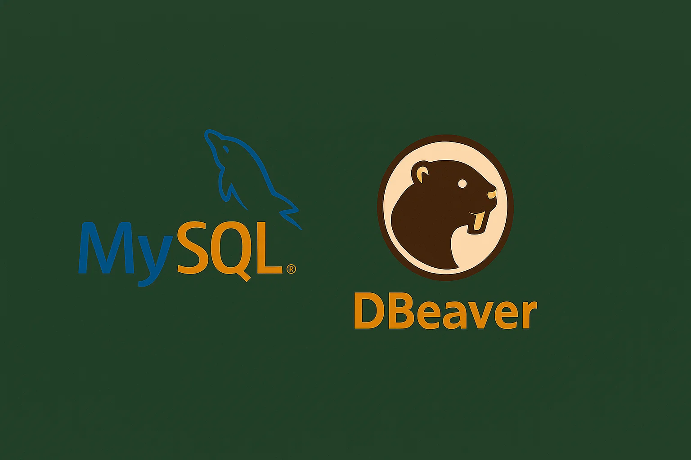

# MySQL-lab



## 📚 Sobre o Repositório

Este repositório foi criado para facilitar o aprendizado e a prática durante as aulas de **Administração de Banco de Dados**. Aqui você encontrará um ambiente MySQL completo configurado via Docker, pronto para ser usado como laboratório para:

- 🎯 Aprender e praticar conceitos de SQL
- 💡 Experimentar com consultas avançadas
- 🔧 Manipular bancos de dados sem configurações complexas
- 📊 Desenvolver habilidades em administração de bancos de dados
- 🚀 Trabalhar em projetos acadêmicos e exercícios práticos

---

## 🐳 Sobre o Container

Este projeto contém um container Docker com MySQL 8.0 configurado e pronto para uso em ambiente de desenvolvimento e aprendizado.

## 📋 Pré-requisitos

- Docker instalado
- Docker Compose instalado

## 🚀 Como usar

### Iniciar o container

```bash
docker-compose up -d
```

### Parar o container

```bash
docker-compose down
```

### Parar e remover os dados (reiniciar do zero)

```bash
docker-compose down -v
```

## 🔧 Configurações

- **Porta:** 3306
- **Usuário:** root
- **Senha:** root123
- **Banco de dados inicial:** aula_db

## 📊 Conectar ao MySQL

### Via linha de comando (dentro do container)

```bash
docker exec -it mysql-abd mysql -uroot -proot123
```

### Via cliente MySQL externo

- **Host:** localhost
- **Porta:** 3306
- **Usuário:** root
- **Senha:** root123
- **Database:** aula_db

### Ferramentas recomendadas

- MySQL Workbench
- DBeaver
- phpMyAdmin
- DataGrip

## 💡 Comandos úteis

### Ver logs do container

```bash
docker-compose logs -f
```

### Verificar status do container

```bash
docker-compose ps
```

### Executar comandos SQL diretamente

```bash
docker exec -it mysql-abd mysql -uroot -proot123 -e "SHOW DATABASES;"
```

## 🗄️ Persistência de dados

Os dados do MySQL são persistidos em um volume Docker chamado `mysql_data`. Isso significa que:

- Os dados permanecem mesmo se você parar o container
- Para resetar completamente, use `docker-compose down -v`
